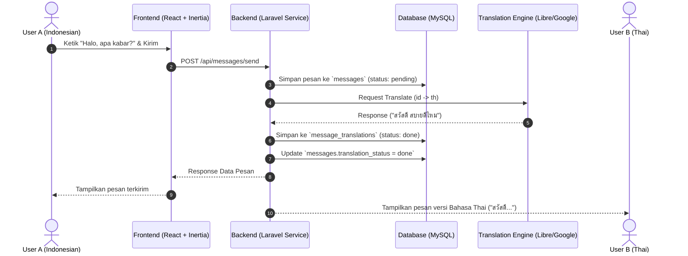
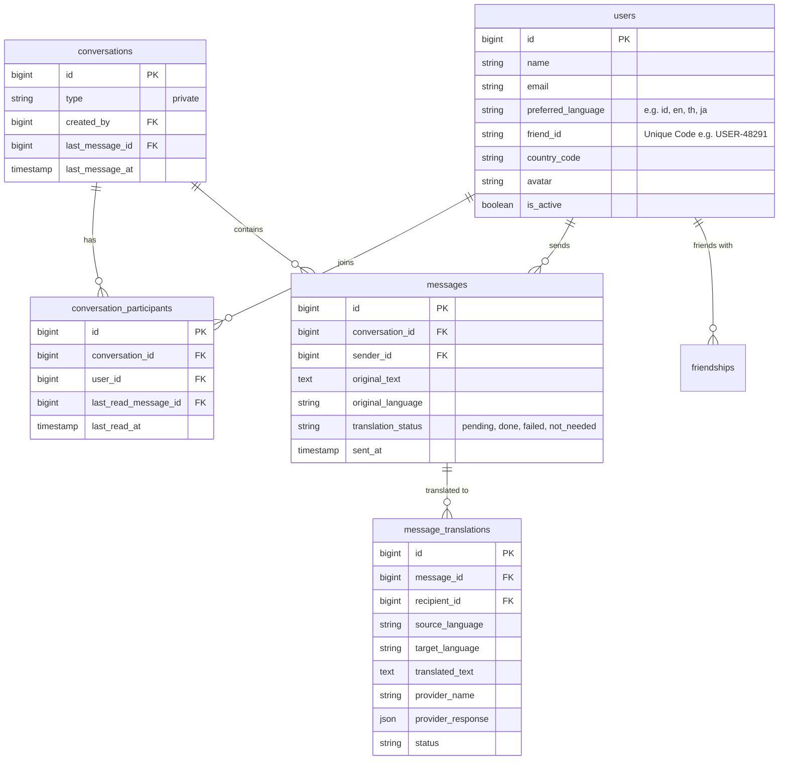

# 🌐 LinguaChat — Real-Time International Chat with Auto-Translation

<div align="center">


<p align="center">
  <b>Aplikasi chat 1-to-1 internasional modern dengan fitur penerjemahan otomatis multi-bahasa secara real-time.</b><br>
  Komunikasi lintas negara kini lebih mudah tanpa perlu menyalin pesan ke aplikasi penerjemah manual!
</p>

[✨ Fitur Utama](#-fitur-utama) •
[🚀 Demo & Arsitektur](#-arsitektur-dan-alur-sistem) •
[🛠️ Tech Stack](#-tech-stack) •
[📦 Panduan Instalasi](#-panduan-instalasi--menjalankan-proyek) •
[⚙️ Konfigurasi Environment](#-konfigurasi-environment-env) •
[🔌 API Endpoints](#-daftar-api-endpoints) •
[🗄️ Skema Database](#%EF%B8%8F-skema-database)

---

</div>

## 📖 Tentang LinguaChat

**LinguaChat** adalah platform komunikasi modern berbasis web yang dirancang khusus untuk memecahkan kendala bahasa dalam percakapan internasional. Setiap pengguna dapat memilih bahasa preferensi mereka sendiri (misalnya: *Bahasa Indonesia, English, Thai, Japanese, Chinese, French, Spanish*). 

Ketika pesan dikirim, sistem secara otomatis mendeteksi bahasa sumber dan menerjemahkannya ke bahasa preferensi penerima secara instan, sembari tetap menjaga keaslian teks asli (*original text*) untuk transparansi data.

> 💡 **Kenapa LinguaChat?**
> * 🚫 **No Copy-Paste**: Tidak perlu lagi membuka Google Translate di tab terpisah.
> * ⚡ **Multi-Tier Translation Engine**: Kombinasi LibreTranslate kustom, public mirrors, dan fallback otomatis ke Google Translate.
> * 🔒 **Data Transparan & Aman**: Pesan asli dan hasil terjemahan disimpan secara terpisah, tidak akan hilang walau penerjemah offline.
> * 📱 **Ultra Responsive & Modern UI**: Tampilan elegan dengan dukungan Dark Mode, animasi halus, dan navigasi intuitif.

---

## ✨ Fitur Utama

### 1. 🤖 Real-Time Auto-Translation Engine
* **Automatic Language Detection & Translation**: Menerjemahkan pesan secara otomatis sesuai bahasa preferensi penerima saat pesan dikirim.
* **Smart Bypass (`not_needed`)**: Jika pengirim dan penerima memiliki preferensi bahasa yang sama, sistem tidak membuang kuota API dan langsung meneruskan teks asli.
* **Multi-Tier Fallback Resilience**:
  1. Primary configured LibreTranslate API (dengan API Key).
  2. LibreTranslate Public Mirrors (`argosopentech`, `terraprint`, `libretranslate.de`).
  3. Google Translate Free Fallback Engine.
* **Failure Tolerance**: Jika seluruh provider penerjemah mengalami gangguan, pesan asli tetap tersimpan dengan status `failed` tanpa menyebabkan chat error atau data hilang.

### 2. 💬 1-to-1 Private Messaging
* Percakapan langsung dan aman antar dua pengguna.
* **Toggle Pesan Asli vs Terjemahan**: Penerima dapat dengan mudah melihat pesan hasil terjemahan atau mengklik untuk melihat pesan teks asli pengirim beserta info bahasa asal.
* **Unread Message Counter & Read Receipts**: Mengetahui percakapan mana yang memiliki pesan baru yang belum dibaca.
* **Auto-Scroll & Smart Scroll to Bottom**: Notifikasi tombol instan ketika ada pesan baru di bawah.

### 3. 👥 Friend Management System & Unique Friend ID
* **Unique Friend ID**: Setiap pengguna mendapatkan identitas unik (contoh: `USER-48291`) untuk memudahkan pencarian teman tanpa harus membagikan email pribadi.
* **Pencarian & Penambahan Teman**: Cari teman berdasarkan Nama atau Friend ID secara instan.
* **Daftar Teman & Quick Chat**: Akses cepat untuk memulai percakapan langsung dari tab Teman.

### 4. 🧹 Privacy & Clear Chat History
* **Clear Chat History**: Pengguna dapat menghapus riwayat percakapan dari sisi mereka sendiri (*hidden threshold*) tanpa menghapus riwayat pesan milik lawan bicara.

### 5. 🔐 Autentikasi Modern & Verifikasi OTP
* **Email OTP Verification**: Registrasi akun menggunakan verifikasi 6-digit kode OTP yang dikirim langsung ke email (didukung oleh Resend / SMTP).
* **Two-Factor Authentication (2FA) & Passkeys**: Fitur keamanan tingkat lanjut dari Laravel Fortify dan WebAuthn Passkeys.
* **Profil & Pengaturan Akun**: Pengaturan nama, email, avatar, status bio, preferensi bahasa, dan mode tampilan (*Dark / Light / System Mode*).

---

## 🏗️ Arsitektur dan Alur Sistem

### Alur Pengiriman & Penerjemahan Pesan



---

## 🛠️ Tech Stack

### Backend
| Komponen | Teknologi | Keterangan |
| :--- | :--- | :--- |
| **Framework** | [Laravel 13.x](https://laravel.com/) | PHP 8.3+ Modern MVC Framework |
| **Monolith Bridge** | [Inertia.js v3 (Laravel Adapter)](https://inertiajs.com/) | SPA tanpa membuat REST API terpisah |
| **Authentication** | [Laravel Fortify](https://laravel.com/docs/fortify) & Passkeys | Auth lengkap dengan OTP, 2FA, dan WebAuthn |
| **Database & ORM** | MySQL 8.x / SQLite + Eloquent ORM | Relasi terstruktur dan transaksi data aman |
| **Mailing Service** | Resend / Brevo SMTP | Pengiriman kode OTP verifikasi email |
| **Code Quality** | Laravel Pint & PHPStan (Larastan) | Linter & Static Analysis standar PSR-12 |

### Frontend
| Komponen | Teknologi | Keterangan |
| :--- | :--- | :--- |
| **Library** | [React 19.x](https://react.dev/) | Library UI berbasis komponen deklaratif |
| **Language** | [TypeScript 5.7+](https://www.typescriptlang.org/) | Type-safe JavaScript |
| **Build Tool** | [Vite 8.x](https://vitejs.dev/) | Bundler super cepat dengan HMR |
| **Styling** | [Tailwind CSS v4](https://tailwindcss.com/) | Modern utility-first CSS framework |
| **UI Primitives** | [Radix UI](https://www.radix-ui.com/) | Accessible, unstyled UI components |
| **Icons** | [Lucide React](https://lucide.dev/) | Icon pack modern dan konsisten |
| **Notifications** | [Sonner](https://sonner.emilkowal.ski/) | Toast notification library |

---

## 🗄️ Skema Database

Sistem dirancang dengan 5 entitas utama untuk memisahkan konten pesan asli dari hasil terjemahan:



---

## 📦 Panduan Instalasi & Menjalankan Proyek

### 📋 Prasyarat Sistem
* **PHP**: `>= 8.3` (dengan ekstensi `pdo_mysql`, `mbstring`, `openssl`, `curl`, `json`)
* **Composer**: `>= 2.7`
* **Node.js**: `>= 20.x` & **npm** / **pnpm**
* **Database**: MySQL `>= 8.0` atau MariaDB `>= 10.4` (atau SQLite untuk development lokal cepat)

---

### 1️⃣ Clone Repositori
```bash
git clone https://github.com/SatyaRizkySaputra0214/Linguachat.git
cd Linguachat
```

### 2️⃣ Install Dependensi Backend & Frontend
```bash
# Install dependensi PHP
composer install

# Install dependensi JavaScript / Node
npm install
```

### 3️⃣ Konfigurasi Environment File
Salin file `.env.example` ke `.env`:
```bash
# Windows PowerShell
copy .env.example .env

# Linux / macOS
cp .env.example .env
```

Generate application encryption key:
```bash
php artisan key:generate
```

### 4️⃣ Konfigurasi Database & Migrasi
Buka file `.env` dan sesuaikan koneksi database Anda:
```env
DB_CONNECTION=mysql
DB_HOST=127.0.0.1
DB_PORT=3306
DB_DATABASE=linguachat
DB_USERNAME=root
DB_PASSWORD=
```

Jalankan database migration:
```bash
php artisan migrate
```

*(Opsional: Jalankan database seeder jika diperlukan)*
```bash
php artisan db:seed
```

### 5️⃣ Menjalankan Server Development

Anda dapat menjalankan backend dan frontend secara bersamaan menggunakan script bawaan:
```bash
# Menjalankan Artisan Server, Queue, dan Vite sekaligus:
npm run dev

# ATAU jalankan secara terpisah di 2 terminal:
# Terminal 1:
php artisan serve

# Terminal 2:
npm run dev
```

Buka browser Anda dan akses aplikasi di:  
👉 **`http://localhost:8000`** atau **`http://127.0.0.1:8000`**

---

## ⚙️ Konfigurasi Environment (.env)

Berikut adalah variabel-variabel konfigurasi utama pada file `.env`:

```env
# ==========================================
# APLIKASI
# ==========================================
APP_NAME=LinguaChat
APP_ENV=local
APP_KEY=base64:...
APP_DEBUG=true
APP_URL=http://localhost:8000

# ==========================================
# DATABASE
# ==========================================
DB_CONNECTION=mysql
DB_HOST=127.0.0.1
DB_PORT=3306
DB_DATABASE=linguachat
DB_USERNAME=root
DB_PASSWORD=

# ==========================================
# MAIL / SMTP (Untuk Pengiriman Kode OTP)
# ==========================================
MAIL_MAILER=smtp
MAIL_HOST=smtp-relay.brevo.com
MAIL_PORT=587
MAIL_USERNAME=your_brevo_username
MAIL_PASSWORD=your_brevo_smtp_key
MAIL_ENCRYPTION=tls
MAIL_FROM_ADDRESS="no-reply@linguachat.com"
MAIL_FROM_NAME="LinguaChat"

# ==========================================
# TRANSLATION SERVICE (LibreTranslate)
# ==========================================
LIBRETRANSLATE_URL=https://libretranslate.com
LIBRETRANSLATE_API_KEY=your_optional_libretranslate_api_key
```

> **Catatan Layanan Terjemahan:**  
> Jika `LIBRETRANSLATE_API_KEY` tidak diisi, sistem LinguaChat secara otomatis menggunakan mirror gratis dan fallback cerdas ke Google Translate Free API sehingga fitur terjemahan tetap langsung berfungsi out-of-the-box!

---

## 🔌 Daftar API Endpoints

Semua endpoint dilindungi oleh autentikasi (`auth:sanctum` / web session):

### 🔐 Autentikasi & OTP
| Method | Endpoint | Deskripsi |
| :--- | :--- | :--- |
| `GET` | `/register` | Halaman form pendaftaran akun |
| `POST` | `/register/send-otp` | Mengirim 6-digit kode OTP ke email pendaftar |
| `POST` | `/register/verify-otp` | Verifikasi kode OTP dan membuat akun pengguna |
| `POST` | `/register/resend-otp` | Mengirim ulang kode OTP ke email |
| `POST` | `/login` | Login pengguna |
| `POST` | `/logout` | Logout pengguna |

### 💬 Chat & Percakapan
| Method | Endpoint | Deskripsi |
| :--- | :--- | :--- |
| `GET` | `/api/conversations` | Mengambil daftar percakapan aktif & unread count |
| `POST` | `/api/conversations/open` | Membuka atau membuat ruang chat 1-to-1 baru |
| `GET` | `/api/conversations/{id}/messages` | Mengambil riwayat pesan percakapan (paginated) |
| `POST` | `/api/messages/send` | Mengirim pesan teks baru & mentrigger auto-translation |
| `POST` | `/api/conversations/{id}/clear-history` | Menghapus riwayat percakapan dari sisi pengguna |

### 👥 Kontak & Teman
| Method | Endpoint | Deskripsi |
| :--- | :--- | :--- |
| `GET` | `/api/friends` | Mengambil daftar teman pengguna |
| `POST` | `/api/friends/add` | Menambahkan teman baru |
| `POST` | `/api/friends/remove` | Menghapus teman dari daftar |
| `GET` | `/api/users` | Mengambil daftar pengguna |
| `GET` | `/api/users/search-by-id` | Mencari pengguna berdasarkan Friend ID unik |

---

## 🧪 Testing & Code Quality

Proyek ini dilengkapi dengan suite pengujian dan pemeriksaan kualitas kode:

```bash
# Menjalankan PHPUnit Tests
php artisan test

# Menjalankan PHP Linter (Laravel Pint)
composer run lint

# Menjalankan PHP Static Analysis (PHPStan / Larastan)
composer run types:check

# Menjalankan TypeScript & React Type Check
npm run types:check

# Menjalankan ESLint & Prettier
npm run lint
npm run format
```

---

## 📁 Struktur Direktori Proyek

```text
Linguachat/
├── app/
│   ├── Http/
│   │   └── Controllers/
│   │       ├── Api/            # ChatController, FriendshipController, UserController
│   │       ├── Auth/           # RegisterOtpController, Authentication Controllers
│   │       └── Settings/       # Profile, Security, Appearance Controllers
│   ├── Mail/                   # RegisterOtpMail (Mailable Class)
│   ├── Models/                 # User, Conversation, Message, MessageTranslation, Friendship
│   └── Services/               # ChatService, TranslationService, ChatHiddenService
├── config/                     # Konfigurasi Laravel & Third Party Services
├── database/
│   ├── factories/              # Model Factories
│   ├── migrations/             # Database Schema Migrations
│   └── seeders/                # Database Seeders
├── resources/
│   ├── css/                    # Global stylesheet & Tailwind CSS tokens
│   ├── js/
│   │   ├── components/         # Reusable UI & Chat components
│   │   ├── layouts/            # AppLayout & AuthLayout
│   │   ├── pages/              # Inertia Pages (Chat, Auth, Settings, Dashboard)
│   │   ├── services/           # Axios API services (chatService, etc.)
│   │   └── types/              # TypeScript Interface & Type definitions
├── routes/
│   ├── web.php                 # Web & Chat API Routes
│   └── settings.php            # User Settings Routes
└── tests/                      # Feature & Unit Tests
```

---

## 🤝 Kontribusi

Kontribusi selalu disambut dengan senang hati! Jika Anda menemukan bug atau memiliki ide fitur baru:
1. Fork repositori ini.
2. Buat branch fitur baru (`git checkout -b feature/AmazingFeature`).
3. Commit perubahan Anda (`git commit -m 'feat: Add some AmazingFeature'`).
4. Push ke branch Anda (`git push origin feature/AmazingFeature`).
5. Buat Pull Request.

---

## 📄 Lisensi

Proyek ini dirilis di bawah lisensi [MIT License](LICENSE). Anda bebas untuk menggunakan, memodifikasi, dan mendistribusikan kode ini untuk tujuan komersial maupun non-komersial.

---

<div align="center">
  <b>Dibuat dengan ❤️ untuk menghubungkan percakapan tanpa batas bahasa di seluruh dunia.</b><br>
  <sub>Copyright © 2026 LinguaChat. All rights reserved.</sub>
</div>
